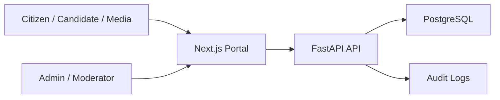

# Architecture

## Goals

The portal informs citizens, receives first-contact work/study applications, supports candidate registration, publishes official content, provides static legal reference links, and gives administrators a controlled moderation surface.

The project is intended to become a real official government internet resource with a production-oriented security posture.

## System Context

## Applications

- `apps/web`: public portal, candidate account UI, and admin shell.
- `apps/api`: REST API, validation, persistence, auth, sessions, RBAC checks, and seed data.
- `infra`: reserved for deployment manifests, ingress, observability, and hardening policies.

Routes are locale-prefixed:

- `/ru`
- `/kk`

No English routes are in scope.

## Frontend Architecture Notes

- Next.js App Router is used for localized routes under `apps/web/app/[locale]`.
- Shared locale handling lives in `apps/web/lib/i18n.ts`.
- API calls should go through typed helpers in `apps/web/lib/api.ts`.
- Some datasets may still be static in `apps/web/lib/data.ts`; active site sections should move to backend-backed content CRUD where required.
- Mobile UX may diverge substantially from desktop UX while keeping the same `/ru` and `/kk` routes.
- Mobile and desktop components should share data loading, validation, translations, and API contracts rather than duplicating business logic.

## Backend Architecture Notes

- FastAPI registers public, auth, and admin route groups.
- SQLAlchemy 2 models are the persistence layer.
- Pydantic schemas should validate all public and admin payloads.
- Alembic owns schema migrations.
- The API must not create tables at application startup.
- PostgreSQL is the production/Docker database.
- SQLite is only a local development fallback through `apps/api/.env`.

## Data Model

Core entities:

- `User`: authenticated identity for Admin, Moderator, and Candidate users; includes role, active/blocked state, Telegram identity, and verified phone fields.
- `CandidateApplication`: candidate registration/application data linked to candidate account flows.
- `RefreshSession`: server-side refresh-token session rows used with the HttpOnly refresh cookie.
- `LoginAttempt`: login success/failure journal and throttling support.
- `TelegramLoginChallenge`: one-time Telegram login request linked to bot deep link, phone confirmation, expiry, and completion state.
- `Appeal`: public first-contact work/study application with tracking code and status.
- `News`: multilingual official news and statements.
- `Page`: managed multilingual static page content where content CRUD is required.
- `RegionOffice`: regional contact information.
- `AuditLog`: administrative and security-sensitive action trail.

Removed or out-of-scope entities should not be reintroduced unless the user changes scope.

## API Surface

Public examples:

- News and page reads.
- Appeal submission.
- Appeal status lookup by tracking code.
- Regional contacts.

Auth/account examples:

- Telegram login start/status/complete.
- Telegram webhook for bot updates and phone contact confirmation.
- Refresh.
- Logout.
- Current user/account data.

Admin examples:

- Dashboard counts/context.
- Appeal list and moderation.
- Candidate application list and moderation.
- Required content CRUD, still pending.

Before using or changing an endpoint, inspect the current route files because implementation may have advanced.

## Security Controls

Current or intended controls:

- RBAC for Admin and Moderator admin surfaces.
- Candidate scope for public authenticated accounts.
- JWT access tokens with expiration.
- HttpOnly refresh cookie backed by server-side `RefreshSession` rows.
- Telegram bot webhook secret validation.
- Telegram phone ownership check through `contact.user_id == message.from.id`.
- Login attempt logging and throttling.
- Pydantic validation on public and admin forms.
- Audit logging for admin actions.
- CORS allowlist.
- Trusted host restrictions.
- Security headers.
- Centralized production-safe error handling.
- Request body size limits.
- Production checks for weak/default secrets.

Production infrastructure expectations:

- HTTPS termination at trusted ingress/reverse proxy.
- HSTS in production.
- WAF/rate limiting at the perimeter.
- Web/API/DB network separation.
- Database not exposed to the public internet.
- Secrets injected through environment or secret manager.
- Backups, restore process, monitoring, alerts, and log rotation.

## Out Of Scope Architecture

Do not design or add architecture for these items unless the user explicitly changes scope:

- eGov integration.
- Digital signature.
- SMS.
- External identity providers.
- File upload.
- Managed document storage.
- Search.
- English locale.
- Separate mobile site or `/mobile` routes.

## Scalability

- Web and API containers should remain stateless.
- PostgreSQL is the primary transactional store.
- API can be horizontally scaled behind a load balancer when sessions are stored in the database.
- Public content can be cached at CDN/reverse-proxy level by locale and route where appropriate.
- File uploads and managed document storage are out of scope.
