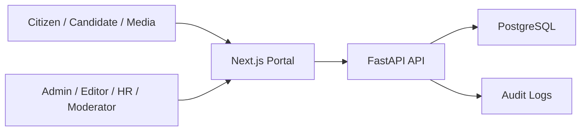

# Architecture

## Goals

The portal informs citizens, receives appeals and threat reports, publishes official content, supports recruitment, and gives editors a controlled administration surface.

## System Context

## Applications

- `apps/web`: public portal and admin shell. Routes are locale-prefixed: `/kk`, `/ru`.
- `apps/api`: REST API, validation, persistence, auth, RBAC checks, and seed data.
- `infra`: reserved for deployment manifests, ingress, observability, and hardening policies.

## Data Model

- `User`: admin identities with role, active status, and 2FA flag.
- `News`: multilingual official news and statements.
- `Page`: managed multilingual static pages.
- `Appeal`: citizen appeal with tracking status.
- `ThreatReport`: threat submission channel.
- `Vacancy`: recruitment content.
- `Document`: laws, orders, and regulations.
- `RegionOffice`: regional contacts.
- `AuditLog`: administrative action trail.

## Security Controls

- RBAC: Admin, Editor, HR, Moderator.
- JWT auth for admin APIs.
- Pydantic validation on public forms.
- Security headers in Next.js.
- CORS allow-list.
- Trusted host middleware.
- Audit-log model for administrative actions.
- Production plan includes HTTPS, CSRF protection for cookie sessions, WAF rate limits, 2FA enforcement, SIEM export, and file scanning.

## Scalability

- Stateless web and API containers.
- PostgreSQL as primary transactional store.
- API can be horizontally scaled behind a load balancer.
- Future media/documents should move to object storage with signed URLs.
- Public content can be cached at CDN level by locale and route.
